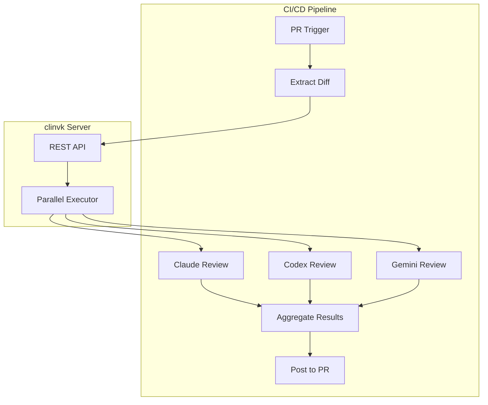

# Automated Code Review

Implement a comprehensive automated code review pipeline that sends pull request diffs to multiple AI backends simultaneously, each specializing in different aspects of code quality.

## Scenario

When a pull request is opened, the system automatically:

1. Extracts the PR diff
2. Sends it to multiple backends for specialized reviews:
   - **Claude**: Architecture and design patterns
   - **Codex**: Performance and code efficiency
   - **Gemini**: Security and potential vulnerabilities
3. Aggregates all reviews into a structured report
4. Posts results as PR comments

## Architecture



## Implementation

### Step 1: clinvk Server Setup

Deploy clinvk as a service accessible from your CI/CD:

```yaml title="docker-compose.yml"
services:
  clinvk:
    image: signalridge/clinvoker:latest
    command: serve --port 8080
    environment:
      - CLINVK_BACKEND=claude
      - CLINVK_API_KEYS=${CLINVK_API_KEYS}
    volumes:
      - ./config.yaml:/root/.clinvk/config.yaml:ro
    ports:
      - "8080:8080"
```

### Step 2: Review Tasks Configuration

Create a template for parallel reviews (placeholders are rendered before sending to the API):

```json title="code-review-tasks.json"
{
  "tasks": [
    {
      "name": "architecture-review",
      "backend": "claude",
      "prompt": "Review this code change for architecture and design patterns.

Focus on:
1. SOLID principles adherence
2. Design pattern usage
3. Code organization and modularity
4. API design consistency
5. Separation of concerns

Provide specific recommendations with code examples where applicable.

DIFF:
{{DIFF}}",
      "output_format": "json"
    },
    {
      "name": "performance-review",
      "backend": "codex",
      "prompt": "Review this code change for performance implications.

Focus on:
1. Algorithmic complexity (Big O)
2. Resource usage (memory, CPU)
3. Database query efficiency
4. Caching opportunities
5. Potential bottlenecks

Suggest optimizations with before/after code comparisons.

DIFF:
{{DIFF}}",
      "output_format": "json"
    },
    {
      "name": "security-review",
      "backend": "gemini",
      "prompt": "Perform a security audit of this code change.

Focus on:
1. Input validation and sanitization
2. Authentication/authorization issues
3. Injection vulnerabilities (SQL, command, etc.)
4. Sensitive data exposure
5. OWASP Top 10 risks

Cite specific lines and suggest fixes.

DIFF:
{{DIFF}}",
      "output_format": "json"
    }
  ]
}
```

### Step 3: GitHub Actions Workflow

```yaml title=".github/workflows/ai-code-review.yml"
name: AI Code Review

on:
  pull_request:
    types: [opened, synchronize]
    paths:
      - "**.go"
      - "**.py"
      - "**.js"
      - "**.ts"

jobs:
  ai-review:
    runs-on: ubuntu-latest
    steps:
      - name: Checkout code
        uses: actions/checkout@v4
        with:
          fetch-depth: 0

      - name: Get PR diff
        id: diff
        run: |
          git diff origin/${{ github.base_ref }}...HEAD > pr.diff
          echo "diff_size=$(wc -c < pr.diff)" >> $GITHUB_OUTPUT

      - name: Check diff size
        if: steps.diff.outputs.diff_size > 50000
        run: |
          echo "Diff too large for AI review (>50KB)"
          exit 0

      - name: Prepare review tasks
        run: |
          DIFF=$(cat pr.diff | jq -Rs .)
          jq --arg diff "$DIFF" '.tasks[].prompt |= sub("\\{\\{DIFF\\}\\}"; $diff)' \
            .github/code-review-tasks.json > review-request.json

      - name: Request AI reviews
        id: reviews
        env:
          CLINVK_URL: ${{ secrets.CLINVK_SERVER_URL }}
          CLINVK_API_KEY: ${{ secrets.CLINVK_API_KEY }}
        run: |
          curl -X POST "${CLINVK_URL}/api/v1/parallel" \
            -H "Authorization: Bearer ${CLINVK_API_KEY}" \
            -H "Content-Type: application/json" \
            -d @review-request.json > review-results.json

          echo "results=$(cat review-results.json)" >> $GITHUB_OUTPUT

      - name: Generate review comment
        id: comment
        run: |
          python3 << 'EOF'
          import json
          import sys

          with open('review-results.json') as f:
              data = json.load(f)

          comment = "## AI Code Review Results\n\n"

          for result in data['results']:
              backend = result['backend']
              name = result.get('name', backend)
              output = result.get('output', 'No output')

              icon = "✅" if result['exit_code'] == 0 else "⚠️"
              comment += f"### {icon} {name.title()} Review ({backend.title()})\n\n"
              comment += f"{output}\n\n"
              comment += "---\n\n"

          # Write to file for GitHub Actions
          with open('review-comment.md', 'w') as f:
              f.write(comment)
          EOF

      - name: Post review comment
        uses: actions/github-script@v7
        with:
          script: |
            const fs = require('fs');
            const body = fs.readFileSync('review-comment.md', 'utf8');

            // Find existing comment
            const { data: comments } = await github.rest.issues.listComments({
              owner: context.repo.owner,
              repo: context.repo.repo,
              issue_number: context.issue.number,
            });

            const existingComment = comments.find(c =>
              c.user.login === 'github-actions[bot]' &&
              c.body.includes('AI Code Review Results')
            );

            if (existingComment) {
              await github.rest.issues.updateComment({
                owner: context.repo.owner,
                repo: context.repo.repo,
                comment_id: existingComment.id,
                body: body,
              });
            } else {
              await github.rest.issues.createComment({
                owner: context.repo.owner,
                repo: context.repo.repo,
                issue_number: context.issue.number,
                body: body,
              });
            }
```

### Step 4: GitLab CI Configuration

```yaml title=".gitlab-ci.yml"
ai-code-review:
  stage: test
  image: alpine/curl:latest
  variables:
    CLINVK_SERVER_URL: $CLINVK_SERVER_URL
    CLINVK_API_KEY: $CLINVK_API_KEY
  script:
    - apk add --no-cache jq git
    - git fetch origin $CI_MERGE_REQUEST_TARGET_BRANCH_NAME
    - git diff origin/$CI_MERGE_REQUEST_TARGET_BRANCH_NAME...HEAD > pr.diff

    - |
      DIFF=$(cat pr.diff | jq -Rs .)
      jq --arg diff "$DIFF" '.tasks[].prompt |= sub("\\{\\{DIFF\\}\\}"; $diff)' \
        ci/code-review-tasks.json > review-request.json

    - |
      curl -X POST "${CLINVK_SERVER_URL}/api/v1/parallel" \
        -H "Authorization: Bearer ${CLINVK_API_KEY}" \
        -H "Content-Type: application/json" \
        -d @review-request.json > review-results.json

    - |
      python3 ci/post-review.py review-results.json \
        --project $CI_PROJECT_ID \
        --mr $CI_MERGE_REQUEST_IID
  rules:
    - if: $CI_MERGE_REQUEST_IID
```

## Advanced: Review Categories

### Severity-Based Filtering

Add severity classification to filter noise:

```json
{
  "tasks": [
    {
      "name": "critical-security",
      "backend": "gemini",
      "prompt": "Review for CRITICAL security issues only (SQL injection, XSS, auth bypass). List only high-severity findings. DIFF: {{DIFF}}"
    },
    {
      "name": "performance-critical",
      "backend": "codex",
      "prompt": "Review for CRITICAL performance issues only (N+1 queries, memory leaks). DIFF: {{DIFF}}"
    }
  ],
  "fail_fast": true
}
```

### Language-Specific Reviews

```json
{
  "tasks": [
    {
      "name": "go-review",
      "backend": "claude",
      "prompt": "Review Go code for: idiomatic patterns, error handling, concurrency safety. DIFF: {{DIFF}}",
      "condition": "{{LANGUAGE}} == 'go'"
    },
    {
      "name": "python-review",
      "backend": "claude",
      "prompt": "Review Python code for: PEP 8 compliance, type hints, async patterns. DIFF: {{DIFF}}",
      "condition": "{{LANGUAGE}} == 'python'"
    }
  ]
}
```

## Review Report Format

Structure the output for consistency:

```json
{
  "summary": {
    "total_issues": 5,
    "critical": 1,
    "warnings": 3,
    "suggestions": 1
  },
  "findings": [
    {
      "severity": "critical",
      "category": "security",
      "file": "auth.go",
      "line": 45,
      "message": "SQL injection vulnerability in query construction",
      "suggestion": "Use parameterized queries"
    }
  ]
}
```

## Best Practices

### 1. Rate Limiting

Configure appropriate rate limits:

```yaml
# config.yaml
server:
  rate_limit_enabled: true
  rate_limit_rps: 5
  rate_limit_burst: 10
```

### 2. Diff Size Limits

Prevent oversized diffs from overwhelming the system:

```bash
MAX_DIFF_SIZE=50000  # 50KB
if [ $(wc -c < pr.diff) -gt $MAX_DIFF_SIZE ]; then
  echo "Diff too large, skipping AI review"
  exit 0
fi
```

### 3. Caching Reviews

Cache results for unchanged files:

```yaml
- name: Cache AI reviews
  uses: actions/cache@v4
  with:
    path: .ai-reviews
    key: ai-reviews-${{ hashFiles('**/*.go') }}
```

### 4. Review Rotation

Rotate which backends review which PRs:

```bash
# Alternate between review combinations
REVIEW_SET=$((PR_NUMBER % 3))
case $REVIEW_SET in
  0) cp review-tasks-claude-codex.json review-tasks.json ;;
  1) cp review-tasks-claude-gemini.json review-tasks.json ;;
  2) cp review-tasks-all.json review-tasks.json ;;
esac
```

## Security Considerations

### API Key Management

- Store clinvk API keys in CI secrets
- Rotate keys regularly
- Use separate keys for different repositories

### Data Privacy

- Review code for sensitive data before sending
- Consider on-premise clinvk deployment
- Implement data retention policies

```bash
# Sanitize diff before sending
grep -v -E "(password|secret|token|key)" pr.diff > sanitized.diff
```

## Troubleshooting

### Issue: Reviews Taking Too Long

**Solution**: Increase parallelism or reduce diff size:

```json
{
  "max_parallel": 3,
  "tasks": [...]
}
```

### Issue: Inconsistent Review Quality

**Solution**: Add specific prompting guidelines:

```json
{
  "prompt": "You are a senior {{ROLE}} engineer. Review this code change following {{COMPANY}} standards..."
}
```

### Issue: Backend Unavailable

**Solution**: Implement fallback logic:

```bash
# Try primary backend, fall back to secondary
if ! curl -f "${CLINVK_URL}/api/v1/backends" > /dev/null 2>&1; then
  echo "Primary clinvk unavailable, using fallback"
  CLINVK_URL=$CLINVK_FALLBACK_URL
fi
```

## Metrics and Monitoring

Track review effectiveness:

```promql
# Review latency
histogram_quantile(0.95,
  sum(rate(clinvk_request_duration_seconds_bucket[5m])) by (le)
)

# Backend availability
clinvk_backend_available{backend="claude"}
```

## Related Use Cases

- [AI Team Collaboration](ai-team-collaboration.md) - Full development workflow
- [API Gateway Pattern](api-gateway-pattern.md) - Production deployment
- [CI/CD Integration](../tutorials/ci-cd-integration.md) - Broader CI/CD setup
